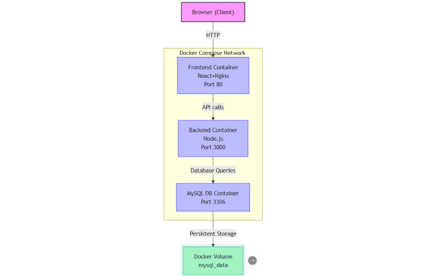
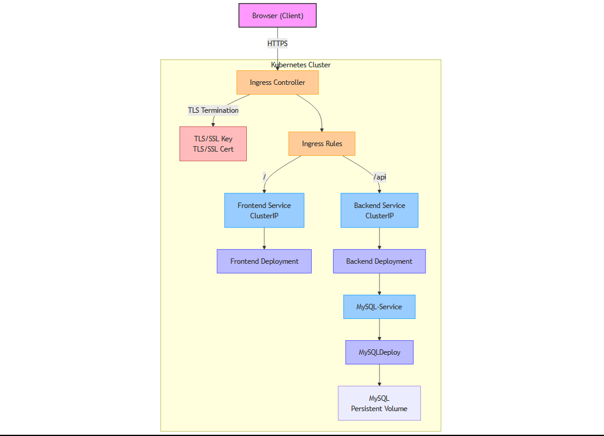

# Microservices Demo Application

A demonstration project showcasing a simple web application deployed using three different container orchestration approaches: Docker containers, Docker Compose, and Kubernetes.

## Project Purpose

This project was created to demonstrate several key concepts in modern application architecture:

1. **Microservices Separation**: Illustrates clear separation between frontend, backend, and database components
2. **Infrastructure-level TLS**: Shows how to implement encryption at the infrastructure layer rather than in application code
3. **API Proxying**: Demonstrates how to hide backend services and route traffic securely
4. **HTTP Methods**: Practical implementation of different HTTP methods (GET/POST) for API communication
5. **Container Orchestration**: Compares different approaches to deploying the same application

By exploring this project, you'll see how these concepts work together in a real-world application while learning deployment patterns from basic containerization to production-grade Kubernetes configurations.

## Project Overview

This project implements a basic user management system with the following features:
- Display existing users from database
- Add new users via form submission
- Persistent data storage
- Scalable microservices architecture

The application is built using:
- **Frontend**: React/Vite with Nginx for static serving and proxying
- **Backend**: Node.js REST API for user management
- **Database**: MySQL for data persistence

## Architecture

The application follows a three-tier microservices architecture:

### Docker-compose workflow:

### K8s workflow:

- **Frontend Service**: Serves static content and routes API requests
- **Backend Service**: Processes HTTP requests and manages database operations
- **Database Service**: Stores application data persistently

## Deployment Options

This project demonstrates three different deployment approaches, each showcasing different container orchestration capabilities:

### 1. Docker Containers

Individual containers with manual networking - demonstrates basic containerization.

[Building Docker Images](dockerfiles/build.md)

### 2. Docker Compose

Multi-container orchestration using Docker Compose - demonstrates service definitions, networking, volumes, and secrets.

[Docker Compose Deployment](docker-compose/compose.md)

### 3. Kubernetes

Production-grade deployment with Kubernetes - demonstrates advanced orchestration features including:
- Persistent volumes
- ConfigMaps and Secrets
- Health checks
- Service discovery
- Ingress with TLS

[Kubernetes Deployment](k8s/kubernetes_build.md)

## Project Structure

```
.
├── README.md               # This file
├── docker-compose/         # Docker Compose configuration
│   └── docker-compose.yml  # Service definitions
├── dockerfiles/            # Dockerfile definitions
│   ├── backend/            # Backend service files
│   ├── frontend/           # Frontend service files
│   └── mysql/              # Database service files
└── k8s/                    # Kubernetes manifests
    ├── backend-yamls/      # Backend deployments and services
    ├── db-yamls/           # Database deployments, services, and storage
    ├── frontend-yamls/     # Frontend deployments and services
    └── ingress-yamls/      # Ingress controller and rules
```

## Getting Started

### Prerequisites

- Docker and Docker CLI
- Docker Compose (for compose deployment)
- Kubernetes cluster and kubectl (for Kubernetes deployment)
- Git

### Quick Start

Clone the repository:
```bash
git clone https://github.com/yourusername/microservices-demo.git
cd microservices-demo
```

Choose a deployment method:

1. **Docker Compose** (simplest approach):
   ```bash
   cd docker-compose
   mkdir -p ./secrets
   echo "YourSecurePassword" > ./secrets/mysql_root_password
   chmod 600 ./secrets/mysql_root_password
   docker-compose up -d
   ```
   Access the application at: http://localhost

2. **Kubernetes**:
   ```bash
   cd k8s
   
   # Create MySQL password secret
   kubectl create secret generic mysql-secret --from-literal=MYSQL_ROOT_PASSWORD=SecurePassword
   
   # Generate self-signed TLS certificate (for HTTPS)
   openssl req -x509 -nodes -days 365 -newkey rsa:2048 \
     -keyout tls.key -out tls.crt \
     -subj "/CN=example.com/O=Example Company"
     
   # Create TLS secret for Ingress
   kubectl create secret tls simple-app-tls --cert=tls.crt --key=tls.key
   
   # Apply Kubernetes manifests
   kubectl apply -f db-yamls/
   kubectl apply -f backend-yamls/
   kubectl apply -f frontend-yamls/
   kubectl apply -f ingress-yamls/
   ```
   Access the application at the Ingress Controller's external IP address with HTTPS.

## API Endpoints

The application provides the following REST API endpoints:

| Endpoint | Method | Description |
|----------|--------|-------------|
| `/api/users` | GET | Retrieve all users |
| `/api/users` | POST | Create a new user |
| `/health` | GET | Backend health check |

## Development

### Building Images

Pre-built images are available on Docker Hub under the `gwynbliedd` namespace. To build your own images:

```bash
cd dockerfiles
# Follow instructions in build.md
```

### Testing

#### With Docker Compose
Test the API endpoints when deployed with Docker Compose:
```bash
# Get users
curl http://localhost/api/users

# Add a user
curl -X POST http://localhost/api/users \
  -H "Content-Type: application/json" \
  -d '{"name":"Test User","email":"test@example.com"}'
```

#### With Kubernetes
Test the API endpoints when deployed with Kubernetes:
```bash
# Get the external IP of the LoadBalancer
EXTERNAL_IP=$(kubectl get svc ingress-nginx-controller -n ingress-nginx -o jsonpath='{.status.loadBalancer.ingress[0].ip}')

# Get users (note the HTTPS and -k flag for self-signed cert)
curl -k https://$EXTERNAL_IP/api/users

# Add a user
curl -k -X POST https://$EXTERNAL_IP/api/users \
  -H "Content-Type: application/json" \
  -d '{"name":"Test User","email":"test@example.com"}'
```

## Security Notes

- TLS encryption is implemented in the Kubernetes deployment
- Database passwords are stored as secrets
- Default configuration uses self-signed certificates
- Production deployments should use proper certificate management

## Contributing

1. Fork the repository
2. Create your feature branch
3. Submit a pull request

## Future Enhancements
Potential improvements for this project:

1. **Helm Charts**: Package Kubernetes manifests as Helm charts for easier deployment and management
2. **Monitoring Stack**: Implement Prometheus and Grafana for metrics collection and visualization
3. **CI/CD Pipeline**: Set up automated building and deployment with GitHub Actions, Jenkins, or GitLab CI
4. **Auto-scaling**: Implement Horizontal Pod Autoscaler for dynamic scaling
5. **Database HA**: Configure a high-availability database cluster
